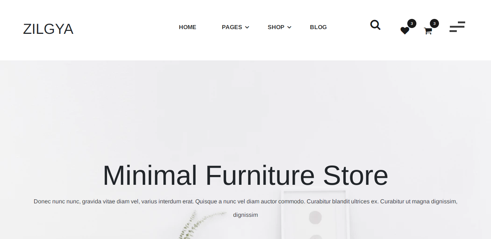
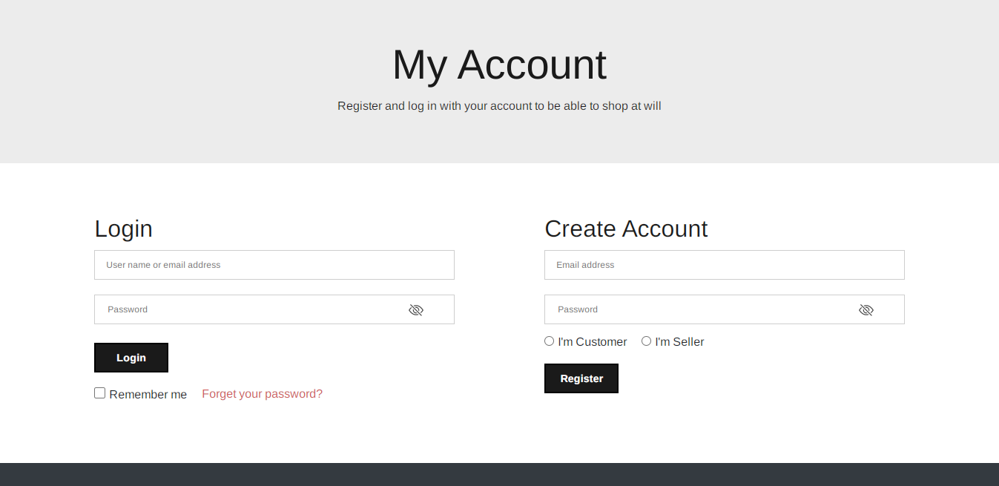
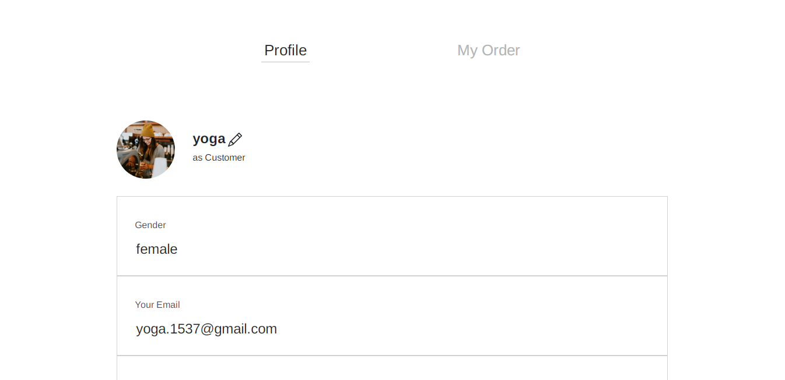
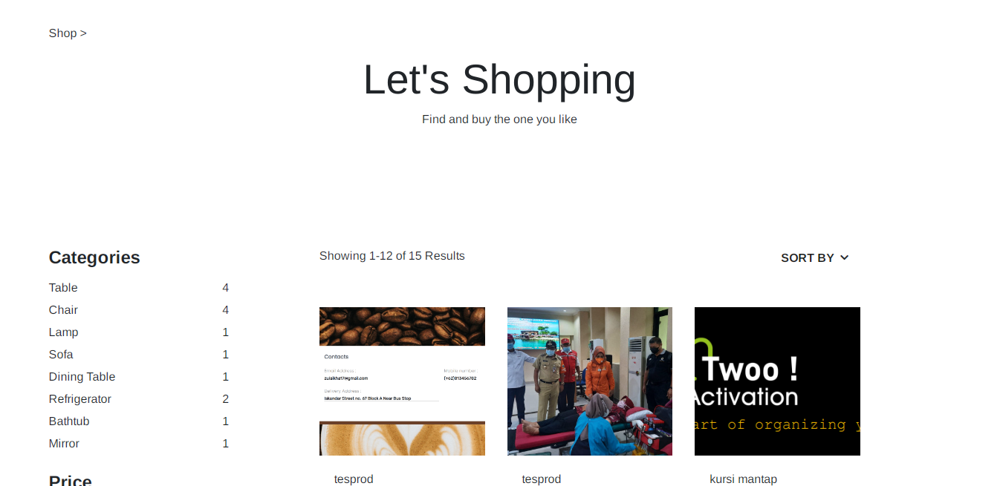
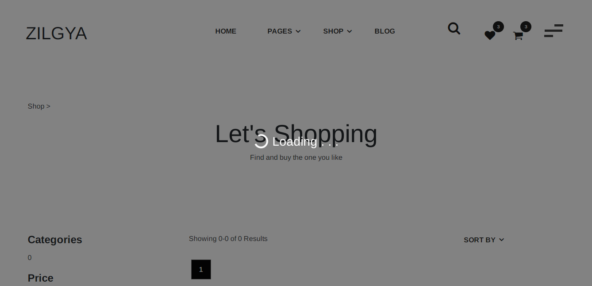
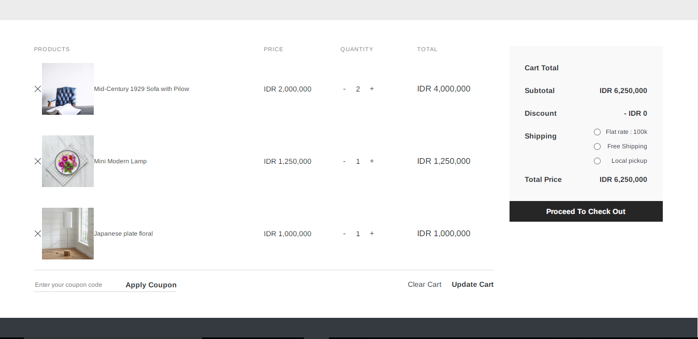

<p align="center">

  <h1 align="center">Zilgya Client</h1>

  <p align="center">
    <br />
    <a href="#">View Live Application</a>
    ·
    <a href="#">Report Bug</a>
    ·
    <a href="#">Request Feature</a>
  </p>
</p>

## Table of Contents

- [About the Project](#about-the-project)
  - [Built With](#built-with)
- [Getting Started](#getting-started)
  - [Prerequisites](#prerequisites)
  - [Installation](#installation)
- [Related Project](#related-project)

## About The Project

Zilgya furniture is an ecommerce store

### Built With


<br>

[](https://getbootstrap.com/)
[](https://reactjs.org/)
[](https://redux.js.org/)
<br>

## Getting Started

### Prerequisites

- [NodeJs](https://nodejs.org/)
- [PostgreSql](https://www.postgresql.org/)
- [Postman](https://www.postman.com/)

### Installation

1. Clone the repo

```sh
$ git clone https://github.com/zilgya/zilgya-client.git
```

2. Install NPM packages

```sh
$ npm install
```

3. Add .env file at root folder project, and add following

```sh
REACT_APP_HOST_API=*YOUR BACKEND HOST*
```


4. Starting application

```sh
$ npm start
```

5. Zilgya Client App is Running

### Preview

<div style="display:flex, flex-direction: column" >








</div>

### Related Project

- [`Frontend-zilgya`](https://github.com/zilgya/zilgya-client)
- [`Backend-zilgya`](https://github.com/zilgya/zilgya-server)
